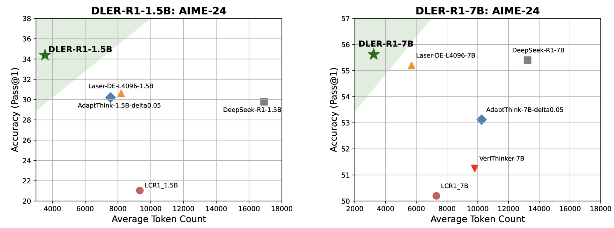

# DLER: Doing Length pEnalty Right - Incentivizing More Intelligence per Token via Reinforcement Learning

<h1 align="center"> 
    <!--  -->
    <!--  -->
    
</h1>

<p align="center">
        🤗 <a href="https://huggingface.co/collections/nvidia/reasoning-efficiency-research">Hugging Face Models</a>&nbsp&nbsp | &nbsp&nbsp 📄 <a href="https://arxiv.org/html/2510.15110v1">Paper</a> | &nbsp&nbsp 📜 <a href="https://nvlabs.github.io/DLER/">Page</a> &nbsp
</p>

## Introduction

DLER is an RL-based training approach built on [VERL](https://github.com/volcengine/verl) that delivers state-of-the-art accuracy and response-length balance, reducing Chain-of-Thought (CoT) length by  ~70% without loss in accuracy.

## Model Performance
<h1 align="center"> 
    
</h1>

DLER surpasses previous state-of-the-art reasoning compression methods across five benchmarks—MATH, AIME-24, AMC, Minerva, and Olympiad—while also improving average response length. When compressing the reasoning traces of DeepSeek-R1-1.5B, DLER-R1-1.5B achieves the highest accuracy on all benchmarks, reducing the average response length to 2,466 tokens—over four times shorter than the original DeepSeek-R1-1.5B. Similarly, for DeepSeek-R1-7B, DLER-R1-7B attains the best balance between accuracy and response length, cutting length by 70% without any loss in accuracy.

## Model Usage
```bash
pip install transformers==4.51.3
```
```python
from transformers import AutoTokenizer, AutoModelForCausalLM
import torch


device = torch.device("cuda" if torch.cuda.is_available() else "cpu")


model = AutoModelForCausalLM.from_pretrained('nvidia/DLER-R1-1.5B-Research').to(device)
tokenizer = AutoTokenizer.from_pretrained('nvidia/DLER-R1-1.5B-Research')


messages = [
   {"role": "user", "content": "Convert the point $(0,3)$ in rectangular coordinates to polar coordinates.  Enter your answer in the form $(r,\\theta),$ where $r > 0$ and $0 \\le \\theta < 2 \\pi.$"+" Let's think step by step and output the final answer within \\boxed{}."},
]


tokenized_chat = tokenizer.apply_chat_template(
   messages,
   tokenize=True,
   add_generation_prompt=True,
   return_tensors="pt"
).to(model.device)


outputs = model.generate(
   tokenized_chat,
   max_new_tokens=10000,
   eos_token_id=tokenizer.eos_token_id
)


print(tokenizer.decode(outputs[0], skip_special_tokens=True))
```

## Training Setup
### Installtion

Install the environment following [here](https://verl.readthedocs.io/en/latest/start/install.html)

Download the Deepscaler training dataset from [here](https://huggingface.co/datasets/sliuau/DeepScaleR-Preview-Dataset-verl-format)

### Training using SLURM

```bash
#!/bin/bash

N=100  # Change this to however many times you want to run the job

for ((i=1; i<=N; i++)); do
    echo "Submitting job $i of $N..."
    JOB_ID=$(sbatch dler_slurm.sh | awk '{print $NF}')
    echo "Submitted with Job ID: $JOB_ID"

    # Wait for the job to finish
    while true; do
        JOB_STATE=$(squeue -j $JOB_ID -h -o "%T")
        if [[ -z "$JOB_STATE" ]]; then
            echo "Job $JOB_ID finished."
            break
        else
            echo "Job $JOB_ID is still $JOB_STATE. Waiting..."
            sleep 300  # Wait 5 minuates before checking again
        fi
    done
done
```

## Citation
If you find DLER useful, please star and cite it:
```bibtex
@article{liu2025dler,
  title={DLER: Doing Length pEnalty Right-Incentivizing More Intelligence per Token via Reinforcement Learning},
  author={Liu, Shih-Yang and Dong, Xin and Lu, Ximing and Diao, Shizhe and Liu, Mingjie and Chen, Min-Hung and Yin, Hongxu and Wang, Yu-Chiang Frank and Cheng, Kwang-Ting and Choi, Yejin and others},
  journal={arXiv preprint arXiv:2510.15110},
  year={2025}
}
```

## Licenses
Copyright © 2024, NVIDIA Corporation. All rights reserved.

This work is made available under the NVIDIA Source Code License-NC. Click [here](https://github.com/nbasyl/DoRA/LICENSE) to view a copy of this license.
